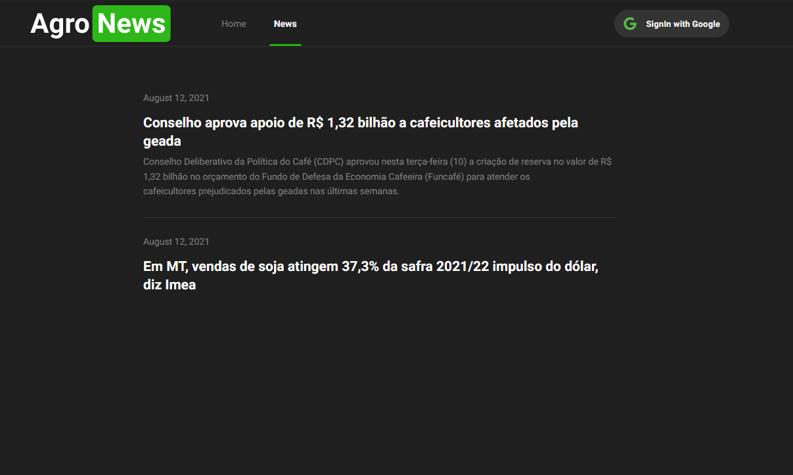
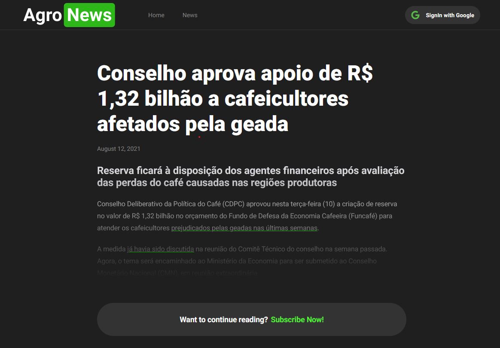

<h1 align="center">
  Agronews
</h1>
<h1 align="center">
    
    
    
</h1>

<br>

## 🧪 Technologies

This project was made using the followings Technologies:

- [NextJS](https://reactjs.org)
- [TypeScript](https://www.typescriptlang.org)
- [FaunaDB](https://fauna.com)
- [Stripe](https://stripe.com)
- [Prismic](https://prismic.io)
- [React Hot Toast](https://react-hot-toast.com)

## 🪐 Running

Para iniciá-lo, siga os passos abaixo:

```bash
# Install all dependencies
$ yarn

# Starting App
$ yarn start
```

App will be available on port: http://localhost:3000.

## 💻 Project

Agronews is a monthly paid platform where you can found the Top News over the Agro world! :)

---

Made with 🧡 by Gabriel Fernandes 👋 [Join our community!](https://ahub.tech/discord)
